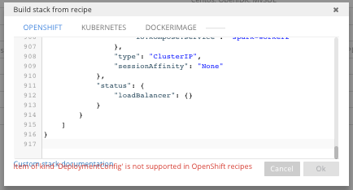

https://kubernetes.io/docs/tasks/configure-pod-container/translate-compose-kubernetes/
``` shell
brew install kompose
kompose -f docker-compose.yml convert
kompose --provider openshift -f docker-compose.yml convert
```

See https://github.com/Logimethods/openshift-template-tool

``` shell
for f in *.yaml; do files="${files} /files/${f}"; done
16:14 ~/Documents/GitHub/nats-connector-spark/eclipse_che/openshift > echo $files

files> openshift-template-tool merge /files/nats-main-deploymentconfig.yaml /files/nats-main-imagestream.yaml /files/nats-main-service.yaml /files/netcat-deploymentconfig.yaml /files/netcat-imagestream.yaml /files/netcat-service.yaml /files/spark-master-deploymentconfig.yaml /files/spark-master-imagestream.yaml /files/spark-master-service.yaml /files/spark-worker1-deploymentconfig.yaml /files/spark-worker1-imagestream.yaml /files/spark-worker1-service.yaml /files/spark-worker2-deploymentconfig.yaml /files/spark-worker2-imagestream.yaml /files/spark-worker2-service.yaml >> ../merge.yaml
```

